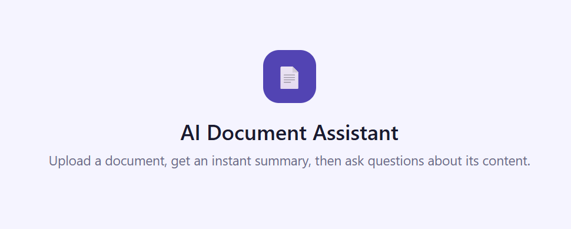

<p align="center">
  
</p>

This project is a web application that allows you to upload PDF, Word, TXT, or CSV files and generate summaries using the Groq Llama 3.1 model. Users can also interactively ask questions about the summarized content.

## Features

* Upload PDF, Word (DOCX), Text (TXT), or CSV documents via a simple web interface.
* Automatically extract text from uploaded files — including OCR for scanned PDFs.
* Generate **multi-level summaries**: brief, standard, or detailed.
* Ask questions interactively about the summarized document using a Groq-hosted LLM.
* Session-based usage (each user has an isolated workspace).
* Embeddings are computed only once per document upload for efficiency.
* Fully reset when a new document is uploaded.
* Dockerized for easy deployment.

## Requirements

* **Docker** installed on your system.
* A **Groq API key** — sign up at [https://groq.com](https://groq.com) to obtain it.
* `.env` file with your API key.

### Example `.env` file

```env id="env_readme"
GROQ_API_KEY=your_groq_api_key_here
```

⚠️ **Never commit your .env file to GitHub.**

## How to Run

### Option 1 — Run with `uv` (recommended)

From the project root:

## How to Run

### Option 1 — Run with `uv`

#### 1. Install `uv`

If `uv` is not already installed:

```powershell
pip install uv
```

#### 2. Run the application

```powershell
$env:PYTHONPATH="src"
uv sync
uv run uvicorn AI_Document_Assitant.main:app --reload
```

This will start the FastAPI application in development mode with automatic reload when files are changed. The application will be available at http://127.0.0.1:8000.

Make sure your `.env` file contains a valid Groq API key.

### Option 2 — Run with Docker

#### 1. Stop any running container

If a previous container is still running, stop it with Ctrl+C in the terminal, or:

```bash
docker ps
docker stop <CONTAINER_ID>
```

#### 2. Build the Docker image

From the project root:

```bash
docker build -t summarizer-app .
```

#### 3. Run the container

```bash
docker run -p 8085:8085 --env-file .env summarizer-app
```

This will start the application on [http://localhost:8085](http://localhost:8085).

Make sure your `.env` file contains a valid Groq API key.

## How to Use

1. Upload a document (PDF, DOCX, TXT, CSV).
2. Select the summary level: brief, standard, or detailed.
3. View the generated summary.
4. Choose whether you want to ask questions about the document.
5. If yes, initialize the Q&A system (embeddings are computed once).
6. Ask questions interactively — answers are based only on the document content.
